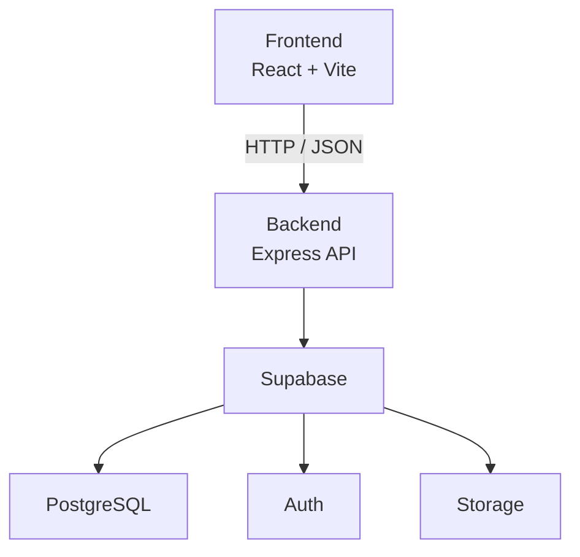

<div align="center">

# NexVitria

**Visibilidad. Conexión. Crecimiento.**

Solución web empresarial para una única organización dedicada a productos naturales y de cuidado personal.

</div>

NexVitria integra una experiencia pública de catálogo, autenticación, perfiles y carrito con una API protegida y servicios administrados en Supabase. Su interfaz conserva una identidad visual sobria en tonos navy y cobre, con un diseño empresarial adaptable a distintos tamaños de pantalla.

La información comercial del catálogo sigue el flujo `React → Express → Supabase`: el frontend no consulta directamente la base de datos ni utiliza archivos mock como fuente de nombres, precios, inventario, imágenes o identificadores.

## Tecnologías utilizadas

### Frontend


### Backend


### Base de datos y servicios


### Seguridad y middleware


### Herramientas


El repositorio no fija una versión de Node.js mediante `engines`, `.nvmrc` o `.node-version`. Debe utilizarse una versión compatible con las dependencias declaradas en los proyectos de frontend y backend.

## Funcionalidades implementadas

### Autenticación

- Registro, inicio y cierre de sesión mediante Supabase Auth.
- Restauración y validación de la sesión desde el frontend.
- Autenticación de solicitudes protegidas mediante Bearer token.
- Roles `CLIENTE`, `EMPLEADO` y `ADMINISTRADOR`.
- Rate limiting específico para registro e inicio de sesión.

### Perfil

- Consulta de los datos personales del usuario autenticado.
- Edición controlada de nombre, apellido y teléfono.
- Carga, reemplazo y eliminación de avatar mediante Supabase Storage.
- Estados de presencia locales, preferencia por usuario y detección de inactividad o desconexión.

### Catálogo

- Cinco categorías y diecisiete productos en el catálogo inicial actual.
- Categorías y productos obtenidos desde la API Express.
- Imágenes públicas servidas mediante Supabase Storage y `imagen_url`.
- Búsqueda por texto, filtrado mediante UUID de categoría y ordenamiento.
- Detalle de producto consultado mediante su UUID real.
- Estados de carga, error, catálogo vacío y producto no encontrado.
- Home conectada al mismo catálogo real que la página de productos.
- Productos destacados definidos mediante metadata visual local; los datos comerciales continúan siendo autoritativos desde la API.

### Carrito

- Disponible exclusivamente para usuarios activos con rol `CLIENTE`.
- Persistencia local separada mediante la clave `nexvitria_cart_<userId>`.
- Identificación de productos mediante UUID reales.
- Rehidratación de los elementos desde el catálogo actual de la API.
- Descarte seguro de identificadores antiguos o incompatibles.
- Validación visual de estado activo, disponibilidad y stock.
- Cantidad máxima efectiva por producto: `min(10, stock)`.

El carrito ofrece una experiencia provisional en el frontend. Los precios y el stock deberán ser validados nuevamente por el backend cuando se implemente el dominio de pedidos.

### Backend

- CRUD de categorías y productos con validaciones de entrada.
- Consultas públicas del catálogo.
- Autenticación y autorización por roles para operaciones de escritura.
- Carga, reemplazo y eliminación de imágenes de productos.
- Persistencia de archivos mediante Supabase Storage.
- Scripts administrativos para inicializar el catálogo y reemplazar imágenes normalizadas de forma controlada.

## Estado del proyecto

### ✅ Implementado

- Autenticación, perfiles, avatar y roles.
- Catálogo real con categorías, productos, búsqueda, filtros y detalle.
- Gestión backend de categorías, productos e imágenes.
- Carrito local por cliente con UUID y límites derivados del stock.
- Integración de PostgreSQL, Supabase Auth y Supabase Storage.

### En desarrollo

- Ejecución operativa y revisión del reemplazo administrativo de imágenes normalizadas.
- Consolidación de documentación secundaria y validaciones integrales del proyecto.

### Pendiente

- Pedidos y detalle de pedidos.
- Checkout y pagos.
- Auditoría completa.
- Panel administrativo completo.
- Reportes.

Estas capacidades pendientes no cuentan todavía con un flujo funcional de producción.

## Arquitectura



- **Frontend:** interfaz, navegación, catálogo, perfil y experiencia del carrito.
- **Backend:** API, reglas de negocio, validaciones, seguridad, autorización y acceso controlado a los datos.
- **Supabase:** persistencia PostgreSQL, autenticación de usuarios y almacenamiento de archivos.

El frontend consume los datos de negocio exclusivamente a través de Express. Las credenciales privilegiadas de Supabase permanecen en el backend.

## Estructura del proyecto

```text
NexVitria/
├── backend/
│   ├── scripts/
│   │   ├── syncCatalog.js
│   │   └── uploadNormalizedProductImages.js
│   ├── src/
│   │   ├── config/
│   │   ├── controllers/
│   │   ├── middlewares/
│   │   ├── routes/
│   │   ├── services/
│   │   ├── app.js
│   │   └── server.js
│   ├── .env.example
│   └── package.json
├── frontend/
│   ├── src/
│   │   ├── assets/
│   │   ├── components/
│   │   ├── config/
│   │   ├── context/
│   │   ├── data/
│   │   ├── hooks/
│   │   ├── pages/
│   │   ├── services/
│   │   └── utils/
│   ├── .env.example
│   └── package.json
├── supabase/
│   └── migrations/
└── README.md
```

Los directorios generados, como `node_modules/` y `dist/`, no forman parte del código fuente versionado.

## Requisitos previos

- Git.
- Node.js compatible con las dependencias del proyecto.
- npm.
- Un proyecto Supabase para autenticación, persistencia y almacenamiento.

## Instalación

Clona el repositorio:

```powershell
git clone https://github.com/JuanEstebanLT/NexVitria.git
cd NexVitria
```

Instala secuencialmente las dependencias del backend y del frontend desde la raíz del repositorio:

```powershell
cd backend
npm install
cd ..
cd frontend
npm install
```

También puede utilizarse `npm ci` cuando se requiera una instalación reproducible basada estrictamente en los archivos `package-lock.json`.

## Variables de entorno

Los archivos `.env.example` documentan los nombres esperados. Deben copiarse como `.env` dentro de cada proyecto y completarse localmente. Los archivos `.env` con credenciales reales no deben incorporarse al repositorio.

### Frontend

| Variable | Uso |
| --- | --- |
| `VITE_API_URL` | URL base de la API Express. El código utiliza `http://localhost:3000` como fallback de desarrollo. |

### Backend

| Variable | Uso |
| --- | --- |
| `NODE_ENV` | Entorno de ejecución. |
| `PORT` | Puerto HTTP del backend; utiliza `3000` cuando no se define. |
| `SUPABASE_URL` | URL del proyecto Supabase. |
| `SUPABASE_PUBLISHABLE_KEY` | Clave publicable utilizada por el backend para los flujos de autenticación. |
| `SUPABASE_SECRET_KEY` | Credencial privada para operaciones privilegiadas del backend. |
| `FRONTEND_ORIGINS` | Lista de orígenes permitidos por CORS, separada por comas. |

Nunca deben publicarse la clave privada de Supabase, contraseñas, access tokens ni JWT reales.

## Ejecución local

### Backend

```powershell
cd backend
npm run dev
```

El servidor utiliza de forma predeterminada:

```text
http://localhost:3000
```

El puerto puede cambiarse mediante `PORT`.

### Frontend

En otra terminal ubicada en el repositorio:

```powershell
cd frontend
npm run dev
```

Vite utiliza normalmente:

```text
http://localhost:5173
```

Si ese puerto no está disponible, Vite puede seleccionar otro y mostrarlo en la salida de ejecución. El origen correspondiente debe estar autorizado en `FRONTEND_ORIGINS`.

## API

La API mantiene respuestas JSON con las propiedades `success`, `message` y `data` cuando corresponde.

| Área | Ruta base | Alcance |
| --- | --- | --- |
| Autenticación y perfil | `/api/auth` | Registro, login, sesión actual, edición de perfil, avatar y logout. |
| Categorías | `/api/categorias` | Consultas públicas y operaciones protegidas de administración. |
| Productos | `/api/productos` | Catálogo público, CRUD protegido y gestión de imágenes. |

Consultas públicas principales:

```http
GET /api/categorias
GET /api/categorias/:id
GET /api/productos
GET /api/productos/:id
```

Las operaciones de creación y actualización requieren autenticación y rol `EMPLEADO` o `ADMINISTRADOR`. Las desactivaciones están reservadas al rol `ADMINISTRADOR`. La subida, reemplazo y eliminación de imágenes de productos requieren `EMPLEADO` o `ADMINISTRADOR`.

## Scripts administrativos

Los scripts siguientes se ejecutan manualmente desde `backend/` y no forman parte del arranque normal del servidor.

### Sincronización del catálogo inicial

Valida categorías, productos e imágenes y sincroniza el catálogo controlado sin utilizar un upsert ciego por nombre.

```powershell
npm run catalog:sync -- --dry-run
npm run catalog:sync
```

### Reemplazo de imágenes normalizadas

Valida los diecisiete PNG normalizados y sus productos asociados antes de permitir cualquier reemplazo.

```powershell
npm run catalog:images:normalized -- --dry-run
npm run catalog:images:normalized
```

Los modos `--dry-run` consultan y validan sin insertar, actualizar, subir o eliminar información. Los modos reales requieren las variables seguras del backend y deben ejecutarse de forma controlada.

## Supabase y migraciones

Las migraciones SQL no se ejecutan automáticamente al instalar las dependencias.

| Migración | Finalidad |
| --- | --- |
| `001_create_profiles.sql` | Crea roles, perfiles, RLS, consulta del perfil propio y el trigger inicial para usuarios nuevos. |
| `002_create_categories_products.sql` | Crea categorías y productos, restricciones, índices, fechas de actualización, RLS y permisos del backend. |
| `003_grant_profiles_backend.sql` | Autoriza al rol de servicio del backend a consultar perfiles. |
| `004_persist_phone_on_new_user.sql` | Actualiza el trigger de registro para persistir el teléfono del usuario. |
| `005_add_profile_avatar.sql` | Agrega `avatar_path`, su permiso de actualización y el bucket privado `avatars`. |
| `006_profile_personal_data_update.sql` | Permite al backend actualizar únicamente nombre, apellido y teléfono del perfil. |
| `007_create_product_images_bucket.sql` | Crea y configura el bucket público `product-images` para imágenes del catálogo. |

Las migraciones deben revisarse y aplicarse conscientemente sobre el proyecto Supabase correspondiente.

## Almacenamiento de imágenes

NexVitria utiliza dos flujos separados en Supabase Storage:

- **Avatares:** bucket privado `avatars`, rutas controladas por usuario y acceso mediante URL firmada.
- **Productos:** bucket público `product-images`; el backend persiste la URL pública final en `productos.imagen_url`.

El backend administra la carga, el reemplazo, la eliminación y los rollbacks necesarios. Los flujos aceptan imágenes JPEG o PNG de hasta 5 MB y utilizan Multer en memoria antes de validar y enviar cada archivo a Storage.

## Seguridad

- Helmet agrega encabezados HTTP de seguridad y Express oculta `X-Powered-By`.
- CORS restringe los orígenes del frontend mediante `FRONTEND_ORIGINS`.
- Express Rate Limit protege registro e inicio de sesión frente a intentos repetidos.
- Supabase valida los JWT y el backend exige Bearer token en rutas protegidas.
- La autorización por roles limita operaciones de catálogo y administración.
- Los controladores validan UUID, campos permitidos, tipos, longitudes y reglas de negocio.
- Las cargas validan cantidad, extensión, MIME, firma binaria cuando corresponde y un límite de 5 MB.
- PostgreSQL utiliza restricciones, permisos para `service_role` y Row Level Security.
- Las credenciales privilegiadas se leen desde variables de entorno y no deben llegar al frontend.

Estas medidas reducen riesgos, pero no sustituyen revisiones de seguridad, pruebas y monitoreo continuos antes de un despliegue productivo.

## Flujo de trabajo Git y GitHub

El repositorio utiliza `main` como rama protegida y sigue este flujo:

```text
Issue → rama específica → cambios → validación → commit
      → push → Pull Request → revisión → Squash Merge → main
```

- Cada cambio debe estar vinculado a un Issue.
- No se realizan commits ni pushes directos a `main`.
- El staging debe limitarse a los archivos del alcance de la tarea.
- El Pull Request debe documentar cambios, validaciones y cualquier limitación conocida.

## Limitaciones actuales

- El carrito es local y todavía no crea pedidos en el backend.
- No existe integración de checkout o pagos.
- No hay panel administrativo completo ni módulo de reportes.
- El repositorio no declara scripts de pruebas automatizadas ni automatización CI/CD.
- La documentación secundaria del frontend requiere una actualización independiente para retirar referencias históricas al catálogo mock.
